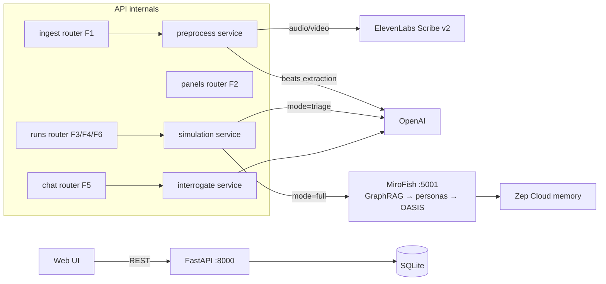

# StoryCritic Backend — Architecture

PRD: `_bmad-output/planning-artifacts/prds/prd-hackathon-2026-07-25/prd.md`

## System overview



## Request flow (happy path, demo)

1. `POST /api/ingest/text` → Submission row → background task builds **Story Representation** (FR-1.4 schema-gated) → status `ready`
2. `GET /api/panels` → pick preset → `POST /api/runs {submission_id, panel_id, mode}`
3. Background `execute_run_task`: **triage** = one OpenAI pass; **full** = MiroFish swarm → personas + report persisted
4. `GET /api/runs/{id}` poll → `GET /api/runs/{id}/report` → verdict UI
5. `POST /api/runs/{id}/chat {persona_id?, message}` → grounded roleplay from stored event logs
6. `GET /api/runs/{id}/report/export` → writer feedback packet (markdown)

## API surface

| Method | Path | FR | Purpose |
|---|---|---|---|
| POST | `/api/ingest/text` | FR-1.1 | paste/upload text |
| POST | `/api/ingest/file` | FR-1.1–1.3 | txt/md/pdf/mp3/wav/m4a/mp4 |
| GET | `/api/ingest/{id}` | F1 | poll story-rep status |
| GET/POST | `/api/panels` | F2 | list presets / save custom |
| GET | `/api/panels/{id}` | F2 | fetch panel |
| POST | `/api/runs` | F3, F6 | start simulation (mode, backtest flag) |
| GET | `/api/runs/{id}` | F3 | poll run status + cost |
| GET | `/api/runs/{id}/report` | F4 | verdict JSON |
| GET | `/api/runs/{id}/report/export` | FR-4.6 | feedback packet markdown |
| GET | `/api/runs/{id}/personas` | F5 | list personas for chat |
| POST/GET | `/api/runs/{id}/chat` | F5 | interrogate persona / report agent |
| GET | `/health` | — | liveness |

## Database schema

```mermaid
erDiagram
    PANELS {
        string id PK
        string name
        bool is_preset
        json config
    }
    SUBMISSIONS {
        string id PK
        string content_hash "sha256, survives purge"
        string media_type "text|audio|video"
        string status
        text raw_text "NULLABLE - TTL purged (NFR-7)"
        json story_rep "FR-1.4 schema"
    }
    RUNS {
        string id PK
        string submission_id FK
        string content_hash
        string panel_id FK
        string mode "full|triage"
        bool backtest
        string status
        int cost_tokens
    }
    REPORTS {
        string run_id PK_FK
        float score
        text rationale
        json pros
        json cons
        json dropoff "beat retention curve"
        json segments "per-group scores"
        json fixes
        text confidence_note "always present FR-6.2"
    }
    PERSONAS {
        string id PK
        string run_id FK
        string group_label
        json profile
        json event_log "traceability NFR-3"
        int dropped_at_beat
    }
    CHAT_MESSAGES {
        string id PK
        string run_id FK
        string persona_id FK "null = report agent"
        string role
        text content
    }

    SUBMISSIONS ||--o{ RUNS : "judged in"
    PANELS ||--o{ RUNS : "configures"
    RUNS ||--o| REPORTS : "produces"
    RUNS ||--o{ PERSONAS : "spawns"
    RUNS ||--o{ CHAT_MESSAGES : "interrogated via"
    PERSONAS ||--o{ CHAT_MESSAGES : "answers"
```

**Content-not-creator, enforced structurally:** no table has an author/writer/user column. `grep -ri "author\|writer_id\|user_id" app/models.py` returns nothing but comments — that's the audit.

## Key design decisions

| Decision | Why |
|---|---|
| SQLite + SQLAlchemy | zero infra, 36h clock; swap `DATABASE_URL` for Postgres later |
| Background tasks via FastAPI `BackgroundTasks` | no Celery/queue in hackathon scope; runs are minutes-long, single-user demo |
| Triage mode implemented first, MiroFish behind `MiroFishClient` | NFR-6 fallback: demo never blocks on the R2 integration spike; interface stays stable either way |
| Persona event logs copied into our DB | chat + traceability (NFR-3) work even if MiroFish session dies; grounded roleplay from stored state |
| `content_hash` on runs | run history survives raw-content purge (NFR-7) without re-identifying anything |
| Story Representation validated by Pydantic (`StoryRep`) | FR-1.4 done-condition is a code gate, not a convention |

## Databricks lane (sponsor)

Unity Catalog **Volumes** = blob storage for raw uploads; **Delta tables** (bronze→silver→gold) = transcripts, story reps, verdicts; **Jobs** = ETL (ingest → ffmpeg → Scribe v2 → story rep). Mirror-only: `services/lakehouse.py` no-ops without `DATABRICKS_HOST/TOKEN/WAREHOUSE_ID` — never on the demo critical path (NFR-6). Full design: `ETL-DATABRICKS.md`.

## Run it

```bash
cd backend
uv sync                      # or: pip install -e .
cp .env.example .env         # fill keys
uv run uvicorn app.main:app --reload --port 8000
# docs: http://localhost:8000/docs
```

## Hour 0–8 spike (R2) — do first

`mirofish_client.py` raises `NotImplementedError` by design. Spike: run MiroFish locally (`npm run setup:all && npm run dev`), feed one story-beats seed, map its actual endpoints into `MiroFishClient.simulate()`. If the social-media frame distorts results → fallback: direct persona loop (generate N persona cards from panel config, iterate beats per persona with memory, aggregate) — lands in `runner.py` next to triage.
