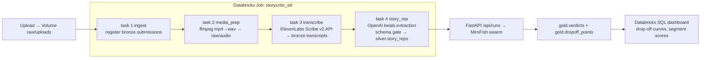

# StoryCritic — Databricks ETL Pipeline Design

Databricks = hackathon sponsor. This maps our preprocessing → transcription → simulation flow onto their stack (medallion architecture). Demo value: judges see sponsor tech carrying the data spine.

## Storage answers

| Need | Databricks primitive | Verified |
|---|---|---|
| Blob storage (video/audio/scripts) | **Unity Catalog Volumes** — any file format incl. audio; UI ≤5GB, SDK for larger ([docs](https://docs.databricks.com/aws/en/ingestion/file-upload/upload-to-volume)) | ✓ |
| Data storage (transcripts, story reps, verdicts) | **Delta Lake tables** ([docs](https://docs.databricks.com/aws/en/files/volumes)) | ✓ |
| ETL orchestration | **Databricks Jobs/Workflows** — manual trigger works on Free Edition ([Medium/Brick Learning](https://medium.com/towards-data-engineering/building-the-right-data-for-ai-deep-dive-into-databricks-job-etl-pipeline-and-ingestion-pipeline-351532b569df)) | ✓ |

## Medallion layout

```
Volume  /Volumes/storycritic/raw/uploads/          ← original files (mp4/mp3/pdf/txt)
Volume  /Volumes/storycritic/raw/audio/            ← ffmpeg-extracted wav

BRONZE  bronze.submissions    (content_hash, media_type, volume_path, ingested_at)
BRONZE  bronze.transcripts    (content_hash, speaker_turns JSON, asr_model, created_at)
SILVER  silver.story_reps     (content_hash, beats JSON, characters, language, schema_ok)
GOLD    gold.verdicts         (run_id, content_hash, panel_id, score, dropoff JSON,
                               segments JSON, fixes JSON, confidence_note, created_at)
GOLD    gold.dropoff_points   (run_id, beat_idx, retained_pct, cliff, paywall_risk)  ← exploded for SQL/dashboards
```

**NFR-7 holds in the lakehouse:** no author/writer column in any table; raw uploads live in Volumes keyed by content hash; TTL cleanup job (VACUUM + delete raw past 120 min) mirrors backend purge.

## Pipeline (Databricks Job, 4 tasks)



Task types: notebooks (Python). Text-only submissions skip T2/T3 (branch on media_type). Trigger: manual (Free Edition) or REST `POST /api/2.1/jobs/run-now` from our FastAPI ingest handler.

## Split of responsibilities (hackathon-pragmatic)

| Stage | Runs where | Why |
|---|---|---|
| Upload + demo UI | FastAPI + frontend (local) | latency, live demo control |
| Blob + tables of record | Databricks Volumes + Delta | sponsor visibility, real lakehouse story |
| ffmpeg/ASR/story-rep | both: local path (demo speed) + Databricks notebooks (pipeline story) | NFR-6 fallback — demo never depends on workspace connectivity |
| Simulation (MiroFish/CAMEL) | local :5001 | OASIS spawns subprocesses; not a Databricks workload |
| Verdict analytics | gold tables + Databricks SQL dashboard | judges see segment scores + drop-off SQL live |

**Demo line:** "Every artifact — raw audio, transcript, story rep, verdict — lands governed in Unity Catalog; the greenlight dashboard is a Databricks SQL query over gold."

## Integration hooks (backend changes, small)

1. `app/services/lakehouse.py` — thin `databricks-sdk` wrapper: `put_file(volume_path, bytes)`, `insert_row(table, dict)`; enabled by env `DATABRICKS_HOST/TOKEN`; no-ops when unset (NFR-6)
2. Ingest handler: after local processing, async-push raw file → Volume, story_rep → silver
3. Run completion: push verdict → gold.verdicts + exploded dropoff
4. Optional: `jobs/run-now` trigger instead of local preprocessing when `PIPELINE=databricks`

## Free Edition constraints

- Jobs manual-trigger only → demo uses local path as primary, Databricks as system-of-record mirror
- No always-on compute → dashboard queries run on serverless SQL warehouse (available in Free Edition)
- Secrets: workspace secrets scope for ElevenLabs/OpenAI keys in notebooks
